# Git & GitHub — The Complete Beginner's Guide

> **For AI-Adventure Students at IIIT Basar**
> Short. Sweet. No fluff. Just what you need to know.

---

## What is Git?

Git is a **version control system** — it tracks every change you make to your files.

Think of it like this:

> You're writing an exam answer. You write version 1, then erase some parts and write version 2. With a normal file, version 1 is **gone forever**. With Git, **every version is saved**. You can go back to any point in time.

**Git is a database.** It stores the complete history of your project — who changed what, when, and why.

---

## Git is a DAG (Directed Acyclic Graph)

This sounds scary. It's not. Let's break it down.

**DAG = Directed Acyclic Graph**
- **Directed** — changes flow in one direction (parent → child)
- **Acyclic** — you can NEVER go back to a previous commit (no loops!)
- **Graph** — commits are connected like a tree/network

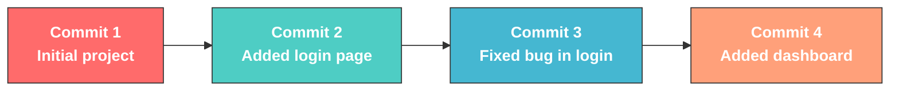

> **Key rule:** Children NEVER point back to parents. Time only moves forward. That's what makes it **acyclic**.

Each commit is a **snapshot** of your entire project at that moment. Git doesn't store differences — it stores the **full picture** every time (efficiently, using compression).

---

## How Git Stores Your Project

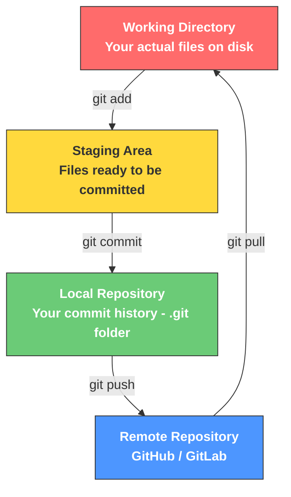

| Zone | Where? | What happens here? |
|------|--------|--------------------|
| **Working Directory** | Your laptop | You edit files here |
| **Staging Area** | Still your laptop | You pick which changes to save |
| **Local Repository** | `.git` folder | Git saves your commits here |
| **Remote Repository** | GitHub.com | Your code lives online for everyone |

---

## What is a Commit?

A commit is a **screenshot of your entire project** at one moment in time.

Think of it like a save point in a video game. Every time you commit, Git takes a photo of **all your files** and stores it permanently. You can always go back to any save point.

### What happens inside a commit?

Every commit stores:
- **A snapshot** — the complete state of every file at that moment
- **A message** — what you changed and why (written by you)
- **A unique ID** — a long hash like `a3f2b7c` (Git generates this)
- **A pointer to its parent** — which commit came before it
- **Who and when** — your name, email, and timestamp

### How does Git know what changed?

When you make **Commit 2**, Git doesn't blindly save everything again. It **compares** Commit 2 with Commit 1, figures out the **difference (called a "diff")**, and stores only the changes efficiently. But logically, each commit represents the **full snapshot** — you can always check out any commit and get the complete project at that point.

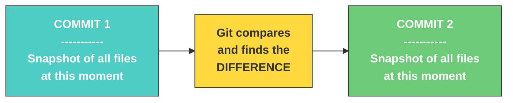

---

## Real Example: Building a Calculator Project

Let's build a real project and watch Git track every change — **with actual code**.

### Commit 1: Create the project

```bash
mkdir calculator && cd calculator
git init
echo "# Calculator App" > README.md
git add README.md
git commit -m "Initial commit: add README"
```

At this moment, your project has **one file**:

```
README.md → "# Calculator App"
```

**Git takes a snapshot:**

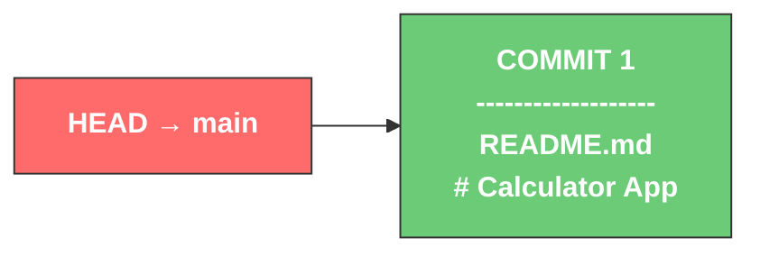

> **HEAD** = "Where am I right now?" It always points to your latest position.
> **main** = The default branch name.

---

### Commit 2: Add the first function

```bash
echo "def add(a, b): return a + b" > calc.py
git add calc.py
git commit -m "Add basic add function"
```

Now your project has **two files**. Git compares with Commit 1 and sees: **one new file added**.

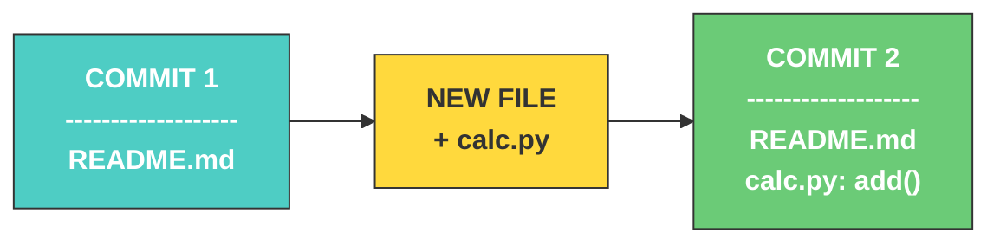

What Git sees (the diff):
```diff
+ def add(a, b): return a + b     ← this whole line is NEW (green = added)
```

---

### Commit 3: Add subtract function

```bash
echo "def subtract(a, b): return a - b" >> calc.py
git add calc.py
git commit -m "Add subtract function"
```

Git compares with Commit 2. Same files, but `calc.py` has **one new line**.

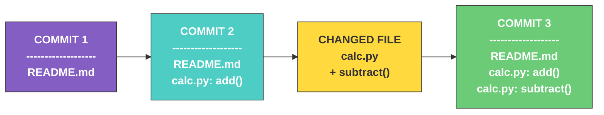

What Git sees (the diff):
```diff
  def add(a, b): return a + b          ← unchanged (no symbol)
+ def subtract(a, b): return a - b     ← NEW line (green = added)
```

---

### Commit 4: Add multiply function

```bash
echo "def multiply(a, b): return a * b" >> calc.py
git add calc.py
git commit -m "Add multiply function"
```

Same pattern — Git compares with Commit 3, finds one new line:

```diff
  def add(a, b): return a + b          ← unchanged
  def subtract(a, b): return a - b     ← unchanged
+ def multiply(a, b): return a * b     ← NEW line
```

---

### The Final Git Graph — All 4 Commits

Now look at the full history. Each box is a **complete snapshot** of the project:

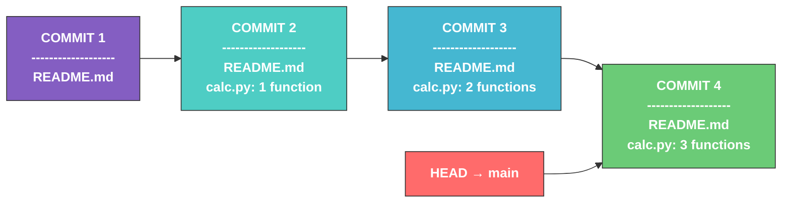

**Key takeaways:**
- Each commit is a **full snapshot** — if you go back to Commit 2, you get the project with only `README.md` and `calc.py` with just `add()`
- Git **compares** each commit with the previous one to efficiently store only what changed
- The arrow means "this commit came from that one" — **you can never go backward** (that's the DAG!)
- You can **always** travel back to any commit. Nothing is ever lost.

### Push to GitHub

```bash
git remote add origin https://github.com/yourname/calculator.git
git push -u origin main
```

Now your entire graph (C1 → C2 → C3 → C4) with all snapshots is on GitHub too!

---

## What is GitHub?

| Feature            | Git                          | GitHub                              |
|-------------------|------------------------------|-------------------------------------|
| Version Control   | Tracks changes in code       | Uses Git for version control        |
| Storage           | Local (your computer)        | Cloud (online storage)              |
| Internet          | Not required                 | Required                            |
| Collaboration     | Limited                      | Strong (PRs, Issues, Reviews)       |
| Interface         | Command Line (CLI)           | Web UI + Desktop apps               |
| Branching         | Yes                          | Yes (with visual support)           |
| Backup            | No automatic backup          | Acts as backup                      |
| Sharing           | Manual                       | Easy via links                      |
| Access Control    | Basic                        | Advanced (public/private repos)     |
| Code Review       | Not available                | Pull Requests for review            |
| Project Management| Not available                | Issues, Projects, Discussions       |

**Simple analogy:**

> **Git** = Microsoft Word's "Track Changes" feature
> **GitHub** = Google Drive where you store and share your Word docs

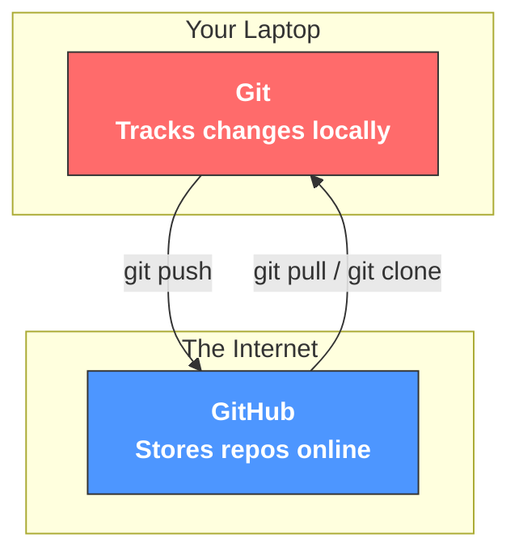

### What can you do on GitHub?

- **Store** your code online (backup + portfolio)
- **Collaborate** with others (Pull Requests)
- **Share** your work with the world (public repos)
- **Track issues** and bugs
- **Host websites** (GitHub Pages)
- **Show off** to recruiters (your GitHub IS your resume)

---

## Branching — Working Without Breaking Things

A **branch** is a separate line of work. You create a branch, make changes, and merge it back when it's ready.

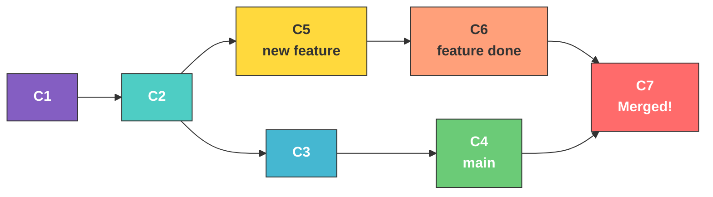

> **Why branch?** So your half-finished work doesn't break the main project. When it's ready, you merge it in.

---

## The Fork & Pull Request Workflow

This is exactly what you do for AI-Adventure assignments:

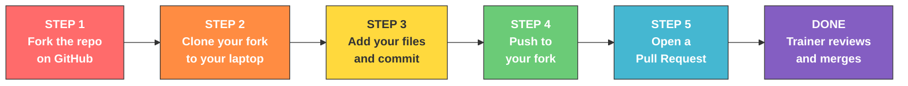

| Step | What Happens |
|------|-------------|
| **Fork** | You create YOUR copy of the repo on GitHub |
| **Clone** | You download YOUR copy to your laptop |
| **Work** | You make changes locally (add assignments) |
| **Push** | You upload changes to YOUR fork |
| **Pull Request** | You ask the trainer to merge your work into the original |

---

## Top 15 Git Commands You'll Use Daily

### Setup Commands (One-time)

```bash
# Install check
git --version

# Tell Git who you are
git config --global user.name "Your Name"
git config --global user.email "your@email.com"
```

### Starting a Project

```bash
# Clone an existing repo
git clone https://github.com/username/repo.git

# OR create a new repo from scratch
git init
```
### Connect to GitHub (ONLY for new repo)
```bash
git remote add origin https://github.com/username/repo.git
```

### The Daily Workflow (You'll use these the most!)

```bash
# Check what's changed
git status

# Stage files (prepare for commit)
git add filename.py          # add one file
git add .                    # add everything

# Save a snapshot
git commit -m "your message here"

# Upload to GitHub
git push origin main

# Download latest changes
git pull origin main
```

### Viewing History

```bash
# See all commits
git log

# See a shorter version
git log --oneline

# See what changed in each file
git diff
```

### Branching (You'll learn this soon)

```bash
# Create and switch to a new branch
git checkout -b feature-name

# Switch back to main
git checkout main

# Merge a branch into main
git merge feature-name
```

---

## The Commit Lifecycle — Visual Summary

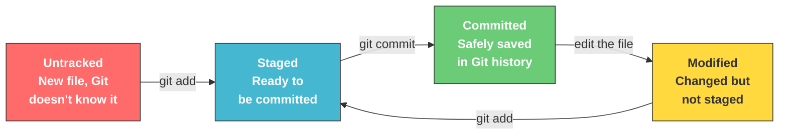

---

## Golden Rules for Beginners

| # | Rule | Why? |
|---|------|------|
| 1 | **Commit often** | Small commits are easier to understand and undo |
| 2 | **Write clear messages** | "Fix login bug" > "asdfgh" |
| 3 | **Pull before you push** | Avoids conflicts with others' changes |
| 4 | **Don't panic** | Git saves everything. You can almost always undo |
| 5 | **Use `git status` constantly** | It tells you exactly what's going on |

---

## Common Mistakes & How to Fix Them

### "I committed but forgot to add a file!"

```bash
git add forgotten_file.py
git commit --amend -m "Updated commit message"
```

### "I want to undo my last commit but keep the changes!"

```bash
git reset --soft HEAD~1
```

### "I accidentally edited the wrong file!"

```bash
git checkout -- filename.py
```

### "I want to see what I changed before committing!"

```bash
git diff
```

## ⚠️ Important Note (While Pushing to GitHub)

👉 GitHub no longer accepts your account password for `git push`

👉 Instead, you must use a **Personal Access Token (PAT)**

### What happens?

When Git asks:
Username: your_username  
Password: ❌ (don’t enter your GitHub password)

👉 Enter your **Personal Access Token** instead

---

### 🧠 Simple Tip:
👉 Token = Password replacement for GitHub

---

### 🔗 How to generate a token:
https://github.com/settings/tokens

👉 Click:
- "Generate new token"
- Select basic permissions (repo)
- Copy and use it as password

---

## Quick Recap — The Big Picture

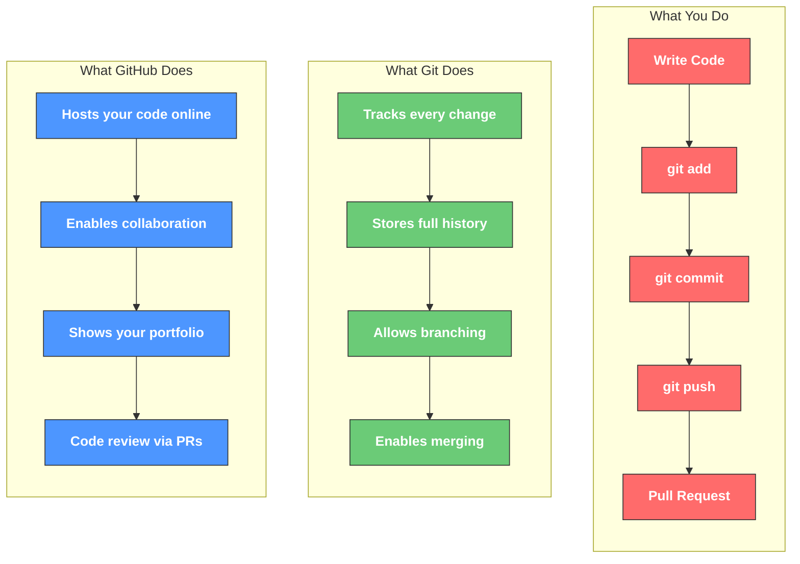

---

> **Remember:** Every expert was once a beginner who refused to give up. You've got this.
